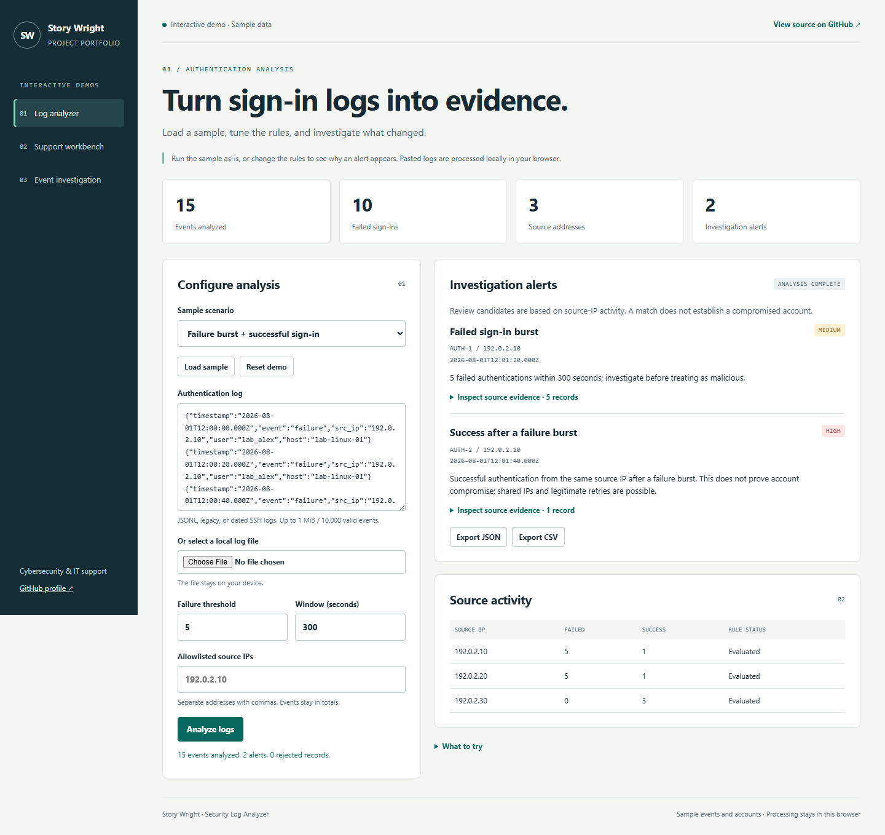
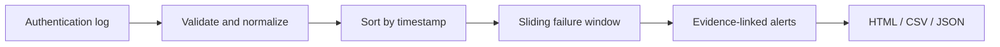

# Security Log Analyzer

[](https://github.com/StoryWright/security-log-analyzer/actions/workflows/ci.yml)

A dependency-free Node.js command-line tool for investigating authentication logs. It extends the original portfolio idea with timestamp validation, configurable time windows, evidence references, allowlists, report exports, and automated tests.

## Browser demo

**[Open the interactive demo](https://storywright.github.io/security-log-analyzer/)**

Load a sample or paste authentication logs, change the detection window, inspect evidence, and download reports. The demo runs in your browser using synthetic fixtures; it does not connect to real accounts or endpoints.

See [browser demo development](docs/BROWSER-DEMO.md) for building and testing.

<details>
<summary>Demo preview</summary>



</details>

## Try it

From this project folder, using Node.js 22 or newer:

```text
node --test
node scripts/demo.js
node src/cli.js --input fixtures/auth-demo.jsonl --output-format text
```

Open `reports/demo.html`. The synthetic fixture has 15 events, 10 failures, five successes, and three source IPs. The default settings produce two alerts: a failed-login burst and a later success from the same IP. Five slow failures on a different IP are a negative control.

```text
node src/cli.js --input fixtures/auth-demo.jsonl --threshold 5 --window-seconds 300 --output-format json --output reports/custom.json --strict
node src/cli.js --input fixtures/auth-demo.jsonl --output-format csv --output reports/custom.csv
node src/cli.js --help
```

Output cannot overwrite the input log. Existing report files may be replaced when explicitly selected with `--output`. Use a new report name when preserving evidence.

## Input contract

One JSON object per line:

```json
{"timestamp":"2026-08-01T12:00:00Z","event":"LOGIN_FAILED","src_ip":"192.0.2.10","user":"lab_alex","host":"lab-win-01"}
```

`timestamp`, `event`, and `src_ip` (or `ip`) are required. Accepted events are `LOGIN_FAILED`, `LOGIN_SUCCESS`, `failure`, and `success`. ISO timestamps need a timezone. User and host are optional.

The original `YYYY-MM-DD HH:mm:ss LOGIN_FAILED IP` format is supported and interpreted as UTC. Selected OpenSSH password failures and successful password/public-key sign-ins are supported. Yearless syslog needs `--year 2026` and is interpreted as UTC; convert non-UTC source times before analysis. This is not a general-purpose parser for every sshd message. Blank and comment lines are ignored; unsupported lines are reported as rejected.

Use `--input-format auto|jsonl|legacy|ssh`. An optional allowlist file contains a JSON array of exact IP addresses. Allowlisted events remain in totals but do not raise alerts. CIDR ranges are not supported.

## Detection and evidence

The pipeline parses and normalizes events, sorts by timestamp, maintains a sliding failure window for each source IP, then creates reports. The default rule is five failures within an inclusive 300-second window. A sustained burst raises one alert until the active window falls below the threshold. A success within 600 seconds of a recorded burst creates one related alert.

Each alert includes source IP, time, explanation, and original line numbers. The JSON report carries detailed evidence; the CSV is a concise alert summary. HTML and CSV exports escape untrusted content. Parse errors report line numbers without repeating raw log fragments.

Exit codes: `0` completed; `1` usage or I/O error; `2` alerts when `--fail-on-alert` is enabled; `3` rejected input when `--strict` is enabled.

## Tests and performance

Tests cover malformed dates and data, IPv6, inclusive window boundaries, independent sources, reordered input, deduplication, success correlation, output escaping, and command-line behavior. `reports/local-validation/test-results.tap` records the included local run.

```text
node scripts/benchmark.js
```

`reports/benchmark.json` records local timings for 10,000 and 100,000 generated, already-normalized events. It excludes parsing and disk I/O. These measurements are not a throughput guarantee.

## Limits and next improvements

The CLI buffers the input; it is not a streaming service. Limits are 64 MiB per input file, 64 KiB per line, and 100,000 valid events by default. Detection groups by source IP across the entire file, so use one host's export at a time or recognize that host activity is combined. Shared IPs, legitimate retries, and clock errors can produce misleading associations. An alert does not establish a successful attack.

Useful next changes: host-and-IP grouping, labeled evaluation on additional authorized logs, streaming ingestion, and precision/recall measured on an independently labeled dataset. The separate [Security Monitoring Lab](https://github.com/StoryWright/security-monitoring-lab) uses host-and-IP grouping for its Wazuh export workflow.

## Files

- `src/analyzer.js`: parsing, detection, and exports.
- `src/cli.js`: command-line interface.
- `fixtures/`: generated synthetic input and expected totals.
- `scripts/`: reproducible demonstration and benchmark.
- `test/`: behavioral tests.
- `.github/workflows/ci.yml`: automated checks; inspect actual results in the Actions tab.


## Architecture


